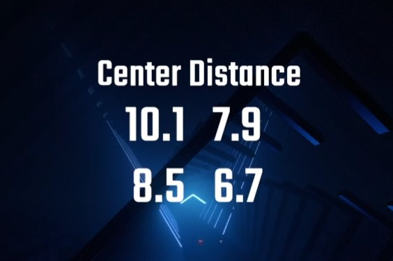

## The English version of the README is [here](README_EN.md)

# CenterDistanceCounter

�a�����m�[�c�̒��S�ƃZ�C�o�[�̋����̕��ςƕW���΍���cm�P�ʂŕ\������[CountersPlus](https://github.com/rynan4818/tournament_overlay)�̃J�X�^���J�E���^�[�ł��B

## �ˑ�MOD

- [BSIPA](https://bsmg.github.io/BeatSaber-IPA-Reloaded/)
- [BeatSaberMarkupLanguage](https://github.com/monkeymanboy/BeatSaberMarkupLanguage)(BSML)
- [SiraUtil](https://github.com/Auros/SiraUtil)
- [CounterPlus](https://github.com/Caeden117/CountersPlus)

## �C���X�g�[�����@
1. [Releases]()����CenterDistanceCounter.dll��_�E�����[�h
2. CenterDistanceCounter.dll��Beat Saber�̃C���X�g�[���t�H���_����Plugins�t�H���_�ɒlj�

Steam��Beat Saber�̏ꍇ�APlugin�t�H���_�̏ꏊ�� 
C:\Program Files (x86)\Steam\steamapps\common\Beat Saber\Plugins 
���f�t�H���g�ɂȂ��Ă��܂��B 
�O�̂��߁B

## �ݒ�

�ݒ�̓Q�[�����CounterPlus�̐ݒ��ʂ���ύX�ł��܂��B 
���ݒ�l��ׂ������߂����ꍇ�A 
Beat Saber\UserData\CenterDistanceCounter.json 
����l����������ď㏑���ۑ����Ă��������B

�ȉ����ꂼ��̐ݒ荀�ڂƂ��̓�e�ɂ‚��Ăł��B 
|����|��e|
|:---|:---|
|SeparateSaber|���E�̃Z�C�o�[�ɕ����ĕ\�����邩�ۂ�|
|DecimalPrecision|�����_�ȉ������܂ł�\�����邩|
|CounterType|�����ƕW���΍��̗����A�����̂݁A�W���΍��݂̂���I��|
|EnableLabel|�J�E���^�[�̏�ɕ\�������"Center Distance Counter"�̕\������邩�ǂ���|
|LabelFontSize|�J�E���^�[�̏�ɕ\�������"Center Distance Counter"�̃t�H���g�T�C�Y��ǂ����邩|
|FigureFontSize|�J�E���^�[�̃t�H���g�T�C�Y��ǂ����邩|
|OffsetX|�J�E���^�[��x�������̈ʒu��ǂ����邩|
|OffsetY|�J�E���^�[��y�������̈ʒu��ǂ����邩|
|OffsetZ|�J�E���^�[��z�������̈ʒu��ǂ����邩|

